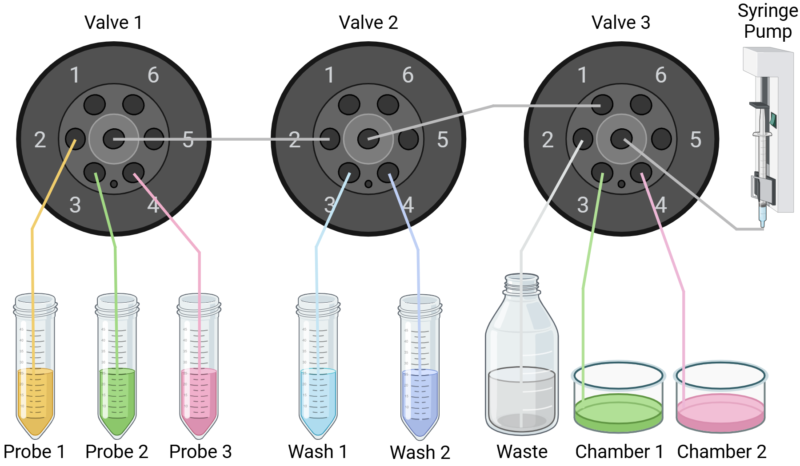
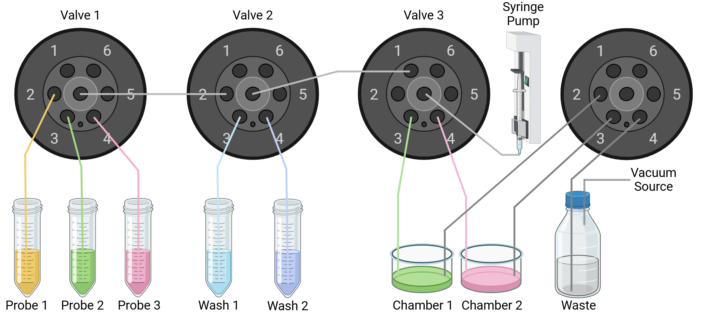

# Fluidics Control for Wollmanlab
This is the python library for controlling the fludic system in Roy Wollman lab at UCLA.
## Hardware
### Design without vacuum

Shown above is the setup currently used on all wide-field microscopes for ATLAS 2D.
In this design, a syringe pump is used for both injecting solution into the chambers and removing solution from the chambers.
By switching different ports on the valve to be connected to the center outlet of the valve, and having the syringe pump move in forward or reverse direction, different solutions can be injected or withdrawed.
### Design with vacuum (under development)

Shown above is the setup to be used for SPIM light-sheet microscope for ATLAS 3D.
Due to the much larger volume of chamber (~30mL), vacuum is to be used for removing solution from the chambers.
You may notice some wide-field microscopes for ATLAS 2D have this setup.
However, the vaccum on these wide-field microscopes is currently not used due to increased sample displacement issues when using vaccum. 
### Material list
|Material|Source|Comments|
|--------|------|--------|
|Syringe Pump and Controller|[Amazon,ASIN: B0BMFJN8YX](https://www.amazon.com/LeTkingok-Injection-Propeller-Laboratory-Dispenser/dp/B0BMFJN8YX/ref=sr_1_3?crid=RNVX1HMA3HSP&dib=eyJ2IjoiMSJ9.9BA6fUVXg3LrKzPnY26Wj7eadsGfdJbIMJCgaDH-ERCf1bGzhkwrqLEYrTAoGPrtKxGwmie8NfH9GLnCgWM4P1FsWlY2rFgVcQlO1VD6XbJCc2p_pu72hhN7C-LNor2mUfQ4mmNSF6hqcqNJzTWQR3aHTa8vH7jlqfiBPfRlVqtg3tUL2GaSbHMexn3LQYwBH-dXz8LihltSvFbzX8Ci2_P2ckOoRIIgPmvspVFyz36gk-sthsfKlSqlq3gG81NCHXnV11LKpH-gEXyrgu5lrEiMxkEXFpBB3mV4qykHWos.MnlOHuRl9nspxmzqD2CUhAHVH5uFSGYI7j40Wyn5LIQ&dib_tag=se&keywords=syringe%2Bpump&qid=1752007670&s=industrial&sprefix=syringe%2Bpum%2Cindustrial%2C148&sr=1-3&th=1)|NA|
|Valve|[VICI EMHMA-CE](https://www.artisantg.com/PLC/84698-8/VICI-EMHMA-CE-Motor-Gearbox-Assembly-Valve-Actuator?srsltid=AfmBOoq9cZVolkv1iidhZU6-FpNaiEPQjOHPMNiQOcf1hzfP-Om_SAG7)|We purchased used ones from random EBay sellers|
|Valve Controller|[VICI EMHCA-CE](https://www.artisantg.com/PLC/84194-4/VICI-EMHCA-CE-Multiposition-Actuator-Control-Module-with-AC-Power-Supply?srsltid=AfmBOopTbHQWbIOQBgDSo29P4nXSQqDI0YAU9dkEQmvLYRTucbwGfigQ)|We purchased used ones from random EBay sellers|
## Software
### Conda environment Setup
```bash 
conda create --name fluidics_control python=3.7 
pip install pyserial 
pip install pandas
```
### Superclasses
The key to understanding how this library works is its four superclasses: `Pump`, `Valve`, `Protocol`, `Fluidics`.

`Pump`: This superclass contains general attributes and methods for the control of all types of pumps in the fluidic system. 
The control of any specific subtype of pump (e.g. syringe pump, diaphragm pump) can be further customized by inheriting this superclass. 

`Valve`: This superclass contains general attributes and methods for the control of all types of valves in the fludic system.
The control of any specific subtype of valve (e.g. rotatory valve, solenoid valve) can be further customized by inheriting this superclass. 

`Protocol`: This superclass contains general attributes and methods for designing a protocol. 
A protocol in the context of this resiporatory means a series of coordinated operation of one or more components (e.g. pump and/or valve).
 
`Fluidics`: This superclass contains general attributes and methods for interpreting `Protocol` and executing `Protocol` by utilizing `Pump` and `Valve`.
To set up a specific fluidic system (e.g. fluidic system for the microscope 'orange'), one can create a subcalss by inheriting this superclass (e.g. OrangeFluidics).

Details of `Fluidics` will be discussed in the next section. 
Before reading the next section, it is recommended to first go to [Pump](Pumps), [Valve](Valves), [Protocol](Protocols) to learn more about these three classes.
### The Fluidics Class
The Fluidics Class offers attributes and methods for two major tasks: 1) interpret and execute `Protocol`, and 2) communicate with other software (e.g a matlab app for controlling the microscope).
#### Task 1: interpret and execute `Protocol`
For interpreting and executing `Protocol`, one should first create a subclass inheriting the FLuidics Class specifically for the fluidics system to be controlled.
The naming convention is `XXXFluidics` where XXX is the nickname for the fluidics system.
Since this subclass will always have an instance of `Pump`,`Valve` and `Protocol`, one can also specify systeme-specific attributes of these three classes in this subclass.

A key attribute of the subclass itself is `Valve_Commands`.
`Valve_Commands` is a dictionary for mapping the port ID (key) to a specific port on a specific valve (value). 
Port ID is just a nickname for each port.
For clarity, it is a good practice to create Port ID based on what the port is connected to. 
For example, one can name the port connected to the container of Tris-Buffered Saline as TBS.
As a convention:
- Capitalized letters (A,B,C,D,E...) are used to refer to chambers holding different samples.
- HybeX (X is a positive integer) are used to refer to readout probes.

One can refer to [fluidics for the microscope Purple](PurpleFluidics.py), [fluidics for the microscope Orange](OrangeFluidics.py),... for examples on how to set up a subclass for a specific fluidic system.
#### Task 2: Communicate with other software: the XXX_Status.txt
In many cases, the fluidic control system need to cooperate with other types of control systems. One frequent case is cooperate with imaging software controlling the microscope. 
Cooperation requires communication between the involved control systems.
The heuristic solution we use is to have different control systems write and read txt files.
More specifically, the Fluidics class has built-in methods for read and write to XXX_Status.txt (XXX is the name of the class, e.g. OrangeFluidics, PurpleFluidics).
When other control system wants the fluidics system to run a specific protocol, it can write to XXX_Status.txt a formatted message:

`Command:Name_of_protocol_to_run*[Chambers to run the protocol]*Other_supplementary_input`

For example `Command:Hybe*[A,B]*25` commands the fluidic system to run the protocol `Hybe` in chamber A and B using readout probe `25`.
When the fluidic system finishes certain command, it can let other systems know by writing to XXX_Status.txt:

`Finished:Name_of_protocol_to_run*[Chambers to run the protocol]*Other_supplementary_input`

For example, `Finished:Hybe*[A,B]*25` means the `Hybe` protocol in the previous example is finished.
### Further reading for the Fluidics Class
- See [Fluidics.py](Fluidics.py) for details on the attributes and methods for carrying out the two above tasks.

## Comments on file version
For a file with suffix _v2, _v3, ..., _vN, the latest version is always the actively used one unless otherwise specified.   
