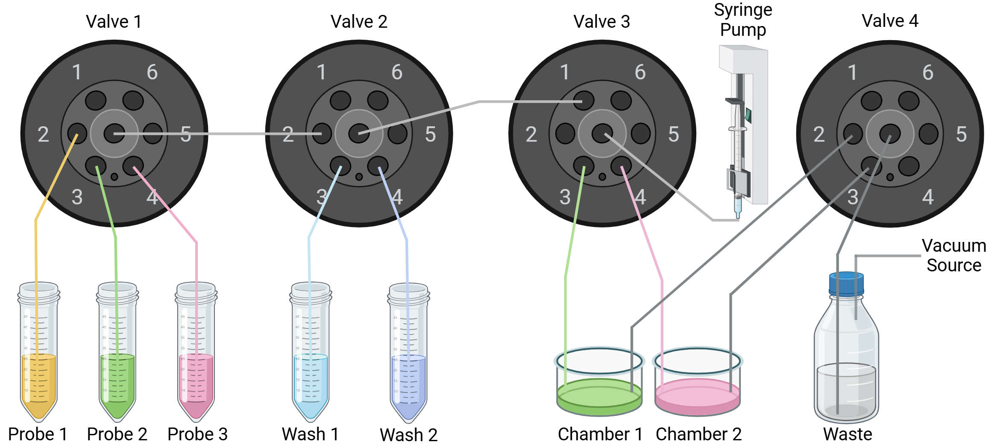

# Fluidics Control for Wollmanlab
This is the python library for controlling the fludic system in Roy Wollman lab at UCLA.
## Hardware
### Design without vacuum

Shown above is the setup currently used on all wide-field microscopes for ATLAS 2D.
In this design, a syringe pump is used for both injecting solution into the chambers and removing solution from the chambers.
By switching different ports on the valve to be connected to the center outlet of the valve, and having the syringe pump move in forward or reverse direction, different solutions can be injected or withdrawed.
### Design with vacuum (under development)

Shown above is the setup to be used for SPIM light-sheet microscope for ATLAS 3D.
Due to the much larger volume of chamber (~30mL), vacuum is to be used for removing solution from the chambers.
You may notice some wide-field microscopes for ATLAS 2D have this setup.
However, the vaccum on these wide-field microscopes is currently not used due to increased sample displacement issues when using vaccum. 
### Material list
|Material|Source|
|--------|------|
|Syringe Pump|To be added|
|Syringe Pump Controller|To be added|
|Valve|To be added|
|Valve Controller|To be added|
## Software
### Superclasses
The key to understanding how this library works is its four superclasses: `Pump`, `Valve`, `Protocol`, `Fluidics`.

`Pump`: This superclass contains general properties and methods for the control of all types of pumps in the fluidic system. 
The control of any specific subtype of pump (e.g. syringe pump, diaphragm pump) can be further customized by inheriting this superclass. 

`Valve`: This superclass contains general properties and methods for the control of all types of valves in the fludic system.
The control of any specific subtype of valve (e.g. rotatory valve, solenoid valve) can be further customized by inheriting this superclass. 

`Protocol`: This superclass contains general properties and methods for designing a protocol. 
A protocol in the context of this resiporatory means a series of coordinated operation of one or more components (e.g. pump and/or valve).
 
`Fluidics`: This superclass contains general properties and methods for interpreting `Protocol` and executing `Protocol` by utilizing `Pump` and `Valve`.
To set up a specific fluidic system (e.g. fluidic system for the microscope 'orange'), one can create a subcalss by inheriting this superclass (e.g. OrangeFluidics).

Details of `Fluidics` will be discussed in the next section. 
Before reading the next section, it is recommended to first go to [Pump](Pumps), [Valve](Valves), [Protocol](Protocols) to learn more about these three classes.
### The Fluidics Class

### Comments on file version
For a file with suffix _v2, _v3, ..., _vN, the latest version is always the actively used one unless otherwise specified.   
